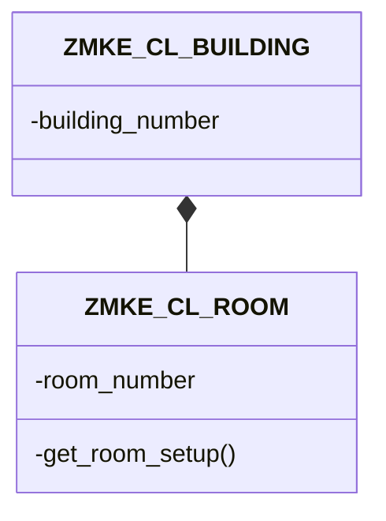

# Class model example

Very simple class model example with buildings, rooms and more to play a little bit with object oriented development and documentation possibilities.

```mermaid
classDiagram
    ZMKE_CL_BUILDING *-- ZMKE_CL_ROOM
    
    class ZMKE_CL_BUILDING{
          -building_number
    }
    
    class ZMKE_CL_ROOM{
          -room_number
          -get_room_setup()
    }    
    
    click ZMKE_CL_BUILDING href "https://github.com/Keller-Michael/class_model_example/blob/main/src/zmke_cl_building.clas.abap" 
    click ZMKE_CL_ROOM href "https://github.com/Keller-Michael/class_model_example/blob/main/src/zmke_cl_room.clas.abap"
```
